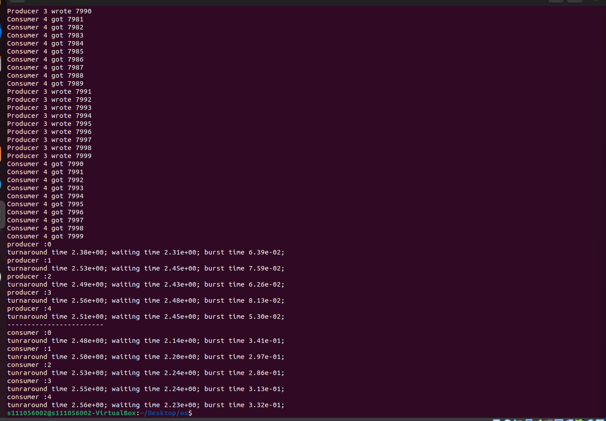

# hw4_4111056002_basic.c

## 作業需求
本程式符合 **Fig. 1** 所描述的作業 70% 基礎要求，完成以下功能：

---

### 基本需求：
1. 實作 **Producer-Consumer** 的多執行緒架構。
2. 建立 **5 個 Producer** 和 **5 個 Consumer**，處理總共 **20 筆資料**。
3. 每個 Consumer 必須取出資料 **4 次**。
4. 程式執行時印出資料取得過程。
5. 多次執行並觀察輸出結果。

---

### Fig. 1: 作業 70% 基礎需求

<center>Fig. 1: 作業基本需求</center>

---

## 程式介紹
程式檔案為 `hw4_4111056002_basic.c`，包含完成上述需求的程式內容。

### 1. **變數定義 (Fig. 2)**


<center>Fig. 2: 變數定義</center>

#### 關鍵變數：
1. **BUFFER_SIZE**：緩衝區允許的最大容量。
2. **CONSUMER**：Consumer 執行緒的數量。
3. **PRODUCER**：Producer 執行緒的數量。
4. **DATA**：總共要處理的資料數量。
5. **mutex, full, empty**：用於同步的 Semaphore。
   - `mutex`：防止競爭條件（Race Condition）。
   - `full`：追蹤緩衝區中已滿的空間數量。
   - `empty`：追蹤緩衝區中剩餘的可用空間數量。
6. **buffer[]**：用於存取資料的共享緩衝區。
7. **in, out**：用於管理 Circular Queue 的輸入與輸出索引。

---

### 2. **函數定義 (Fig. 3)**


<center>Fig. 3: 函數定義</center>

#### 主要函數：
1. **producer_func**：接受 Producer 的 ID 作為參數並執行以下操作：
   - 當緩衝區滿時，等待 `empty` Semaphore：
     ```c
     sem_wait(&empty);
     ```
     
     <center>Fig. 4: empty Semaphore 被滿時的示意圖</center>
   - 使用 `sem_wait(&mutex)` 鎖定 Critical Section，防止競爭條件。
   - 將資料加入緩衝區並更新 **Circular Queue** 的索引：
     ```c
     buffer[in] = item;
     in = (in + 1) % BUFFER_SIZE;
     ```
   - 使用 `sem_post(&mutex)` 解鎖 Critical Section。
   - 使用 `sem_post(&full)` 發送信號，更新緩衝區的狀態。
   - 使用 `pthread_exit(NULL)` 結束執行緒。

2. **consumer_func**：與 Producer 函數類似，但從緩衝區中取出資料。

---

### 3. **主函數 (Fig. 5)**


<center>Fig. 5: 主函數</center>

#### 初始化：
```c
sem_init(&mutex, 0, 1);
sem_init(&full, 0, 0);
sem_init(&empty, 0, BUFFER_SIZE);
```

* 初始化 mutex，使 Critical Section 每次只能有一個執行緒進入。
* 將 full 設置為 0，表示初始緩衝區為空。
* 將 empty 設置為 BUFFER_SIZE，表示緩衝區可用空間數量。

#### 建立執行緒：
```c
pthread_t p[PRODUCER];
int index_p[PRODUCER];

```
* 建立 Producer 執行緒及其對應的 ID 陣列。
```c
pthread_t c[CONSUMER];
int index_c[CONSUMER];

```
#### 建立 Consumer 執行緒及其對應的 ID 陣列。
```c
for (int i = 0; i < PRODUCER; ++i) {
    index_p[i] = i; // 指定 Producer ID
    pthread_create(p + i, NULL, producer_func, (void*)(index_p + i));
}
```
1. 遍歷每個 Producer，指定其 ID，並使用 pthread_create() 建立執行緒執行 producer_func。
```c
for (int i = 0; i < CONSUMER; ++i) {
    index_c[i] = i; // 指定 Consumer ID
    pthread_create(c + i, NULL, consumer_func, (void*)(index_c + i));
}
```
2. 同樣地，為每個 Consumer 指定 ID 並建立執行緒執行 consumer_func。
```c
for (int i = 0; i < PRODUCER; ++i) pthread_join(p[i], NULL);
for (int i = 0; i < CONSUMER; ++i) pthread_join(c[i], NULL);
```
3. 清除
```c
sem_destroy(&mutex);
sem_destroy(&full);
sem_destroy(&empty);
```

# HW4_4111056002_advanced.c
## 作業需求
本程式進一步完成 Producer-Consumer 問題，並新增了執行時間的統計功能、資料輸出到檔案的功能，以及相關輔助函數的實作。


## 基本需求
1. **Producer-Consumer 的執行時間統計**：包含 burst time 與 turnaround time。
2. **處理 10,000 筆資料**。
3. **建立 `out` 資料夾** 用於存放輸出結果。
4. **建立 `資料.txt` 檔案**，記錄每個 Consumer 的編號及處理的資料。
## 程式碼說明

### 1. **變數定義**

<center>Fig 1.</center>

<div style="color:red; font-size: 30px;"><strong>注意：變數的基本介紹已在之前的程式碼中提過，以下只補充新增的部分。</strong></div>

1. **`burst_time_c[CONSUMER]`**: 存取每個 Consumer 的 burst time。
2. **`burst_time_p[PRODUCER]`**: 存取每個 Producer 的 burst time。
3. **`turnaround_time_c[CONSUMER]`**: 存取每個 Consumer 的 turnaround time。
4. **`turnaround_time_p[PRODUCER]`**: 存取每個 Producer 的 turnaround time。

---
### 2. **資料結構**
#### HashMap 結構
1. **定義名為 `hashmap` 的結構**，用於依據 `index` 存取資料：
   - **Array 為布林陣列**，若該 index 被某個 key 擁有，則設為 `True`。
   - 表示該 key 的值存在。
2. **實作 `get` 函數**: 使用 key 查找對應的 value。
3. **實作 `put` 函數**: 使用 key 和 value 更新 HashMap。


<center>Fig 2. HashMap 結構與操作</center>

---

### 3. **函數定義**

#### Utility 函數
以下是一些輔助工具函數：
1. **`create_out_folder`**:
   - 負責建立 `out` 資料夾。
   - 若資料夾已存在，則刪除舊的並建立新的資料夾。
2. **`write_file`**:
   - 負責將資料寫入檔案。
   - 如果 `out=True`，則將資料輸出到 `out` 資料夾中。
3. **`cal_diff`**:
   - 計算時間差，根據 `end` 和 `start` 時間變數，計算執行時間。


<center>Fig 3. Utility 函數的程式碼</center>
---

#### Producer 與 Consumer 函數
1. **執行時間統計**：
   - 使用 `timespec g_start` 和 `timespec g_end` 計算 **turnaround time**。
   - 使用 `timespec start` 和 `timespec end` 計算 **burst time**，實際記錄 Critical Section 的執行時間。
2. **更新數據**：
   - 將 `burst_time` 累加至總陣列。
   - 將 `turnaround time` 直接指定為該執行緒的執行時間總和。


<center>Fig 4., Fig 5. Producer 與 Consumer 函數</center>


### 4. **主函數**
1. **計算 Waiting Time**:
   - 使用公式：`waiting time = turnaround time - burst time`。
   - 計算每個 Producer 和 Consumer 的等待時間。
2. **輸出結果到檔案**：
   - 使用 `hashmap` 的迭代方式，根據 Producer 和 Consumer 的 index，檢查布林陣列。
   - 若布林值為 `True`，則表示該 instance 處理了對應的資料，並記錄到 `result.txt` 中。


<center>Fig 6. 主函數程式碼截圖</center>

# Command
## Basic
```bash
gcc hw4_4111056002_basic.c -o hw4_1
./hw4_1
```
## Advanced
```bash
gcc hw4_4111056002_advanced.c -o hw4_2
./hw4_2
```
# 輸出
## Basic


## Advance
